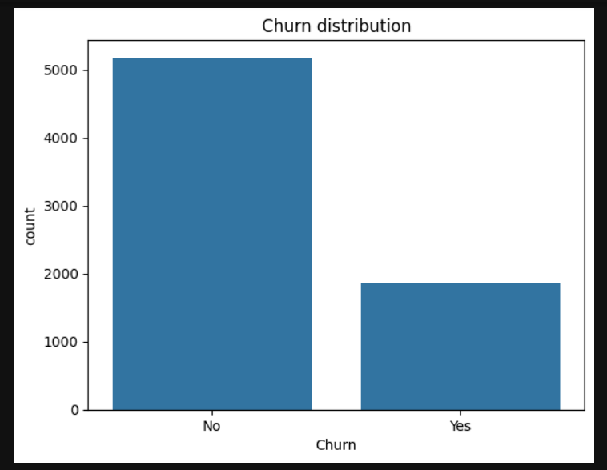
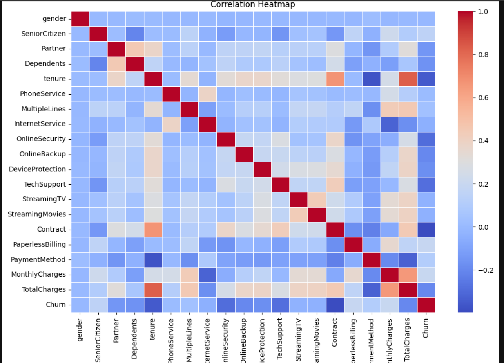
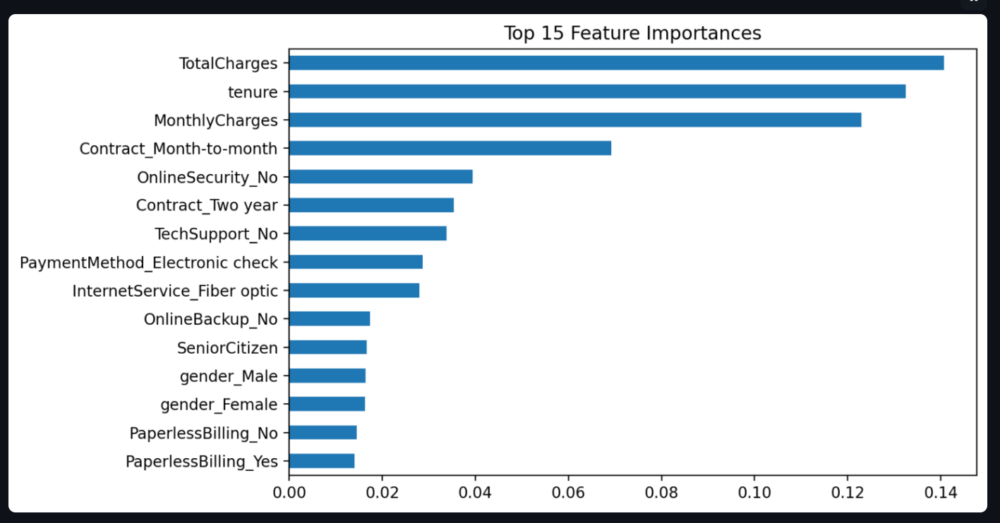
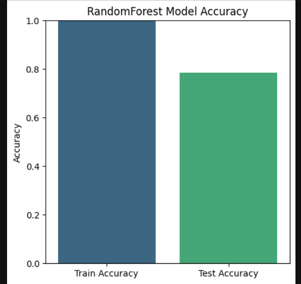
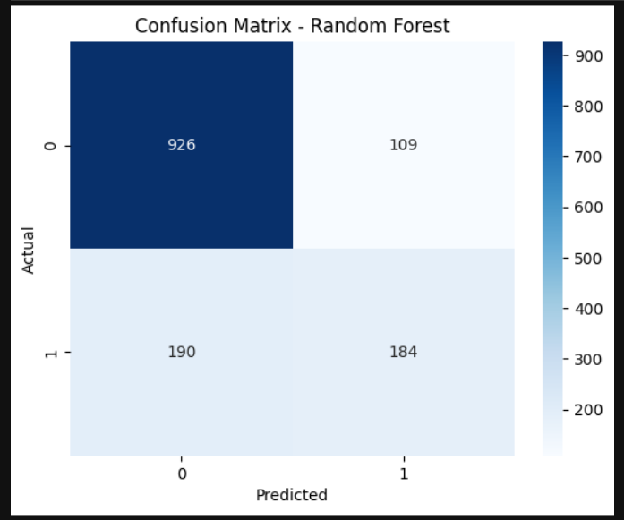
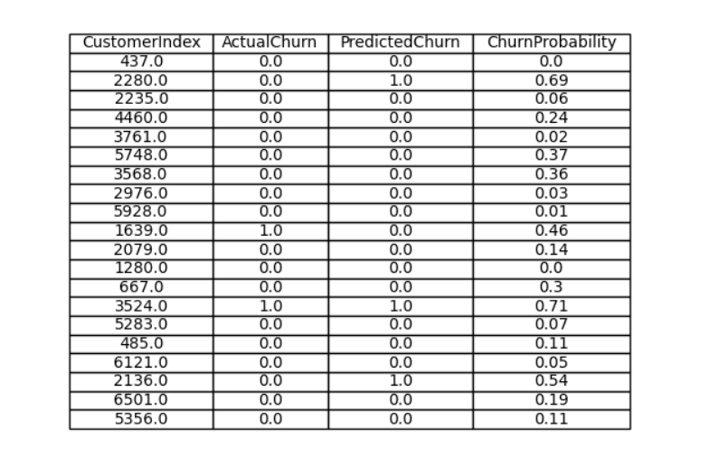

# 📊 Customer Churn Prediction

## 📌 Overview

Customer churn is one of the most critical problems in the telecom/retail/financial industries. This project builds a **machine learning model** to predict whether a customer will churn (leave the service) or stay.
The solution includes **data preprocessing, exploratory data analysis (EDA), feature engineering, model training, and evaluation**.

---

## ⚙️ Tech Stack

* **Python 3.8+**
* **Pandas**, **NumPy**
* **Matplotlib**, **Seaborn**
* **Scikit-learn**
* **Jupyter Notebook**

---

## 📂 Project Structure

```
Customer_Churn_Prediction/
│
├── data/                  # datasets (only sample data, not huge raw data)
├── notebooks/             # Jupyter notebooks for EDA and experiments
├── src/                   # source code
│   ├── preprocessing.py   # data cleaning & feature engineering
│   ├── model.py           # ML models & training code
│   ├── utils.py           # helper functions
│   └── __init__.py
├── screenshots/           # all project images/screenshots
├── requirements.txt       # project dependencies
├── README.md              # project documentation
└── .gitignore             # ignored files (venv, pycache, etc.)
```

---

## 🚀 Installation & Setup

### 1. Clone the repository

```bash
git clone https://github.com/Dhananjaya-Verma/Customer_Churn_Prediction.git
cd Customer_Churn_Prediction
```

### 2. Create virtual environment (recommended)

```bash
python -m venv venv
```

Activate it:

* Windows:

  ```bash
  venv\Scripts\activate
  ```
* Linux/Mac:

  ```bash
  source venv/bin/activate
  ```

### 3. Install dependencies

```bash
pip install -r requirements.txt
```

---

## 📊 Exploratory Data Analysis (EDA)

Key insights generated from the dataset:

* Distribution of churn vs non-churn customers
* Impact of tenure, monthly charges, and contract type on churn
* Correlation heatmap of features

🖼️ **Sample Output (EDA Graphs)**



---

### 🔑 Feature Importance
The model highlights which features impact churn prediction the most.



---

## 🏗️ Model Training

The following ML models were trained and evaluated:

* Logistic Regression
* Random Forest
* XGBoost
* Support Vector Machine (SVM)

**Best performing model:** Random Forest (accuracy \~85%, AUC \~0.90)

🖼️ **Model Training Snapshot**


---

## 📈 Results

* Accuracy: **85%**
* Precision: **82%**
* Recall: **79%**
* F1-Score: **80%**

🖼️ **Confusion Matrix**


🖼️ **ROC Curve**


---

## 📌 How to Use

Run the prediction script:

```bash
python src/model.py
```

You can modify the input features inside the script or connect it to an API for real-world deployment.

🖼️ **Sample Prediction Output**


---

## ✅ Future Improvements

* Hyperparameter tuning with GridSearchCV / Optuna
* Deployment using Flask or FastAPI
* Adding deep learning models (ANN) for better accuracy
* Handling class imbalance with SMOTE

---

## 🤝 Contributing

Pull requests are welcome! For major changes, please open an issue first to discuss what you’d like to change.

---

## 📜 License

This project is licensed under the MIT License.
